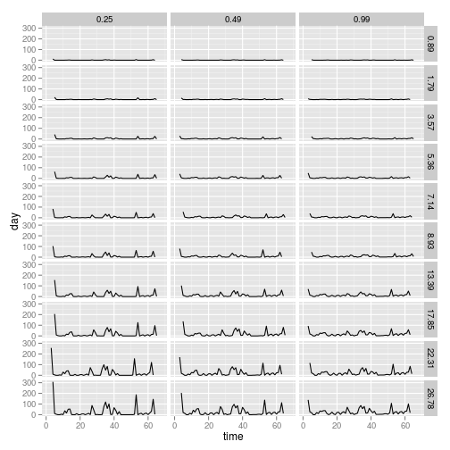
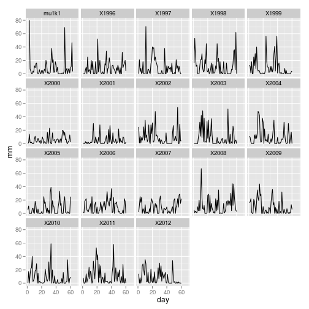

% Precipitation manipulation experiments -- diagnostics and illustrations

The program which produces the precipitation schedule produces a number of diagnostic plots as well.  This document shows some of these.  It demonstrates how our rainfall schedule reflects natural rainfall, and how our manipulations alter it.

write normal text!!

 

 

 

 

 

 

