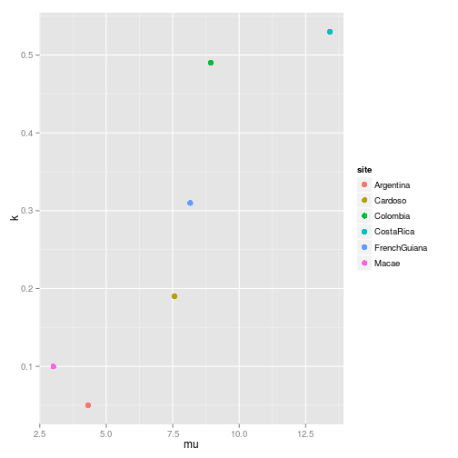
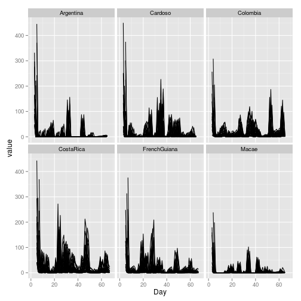
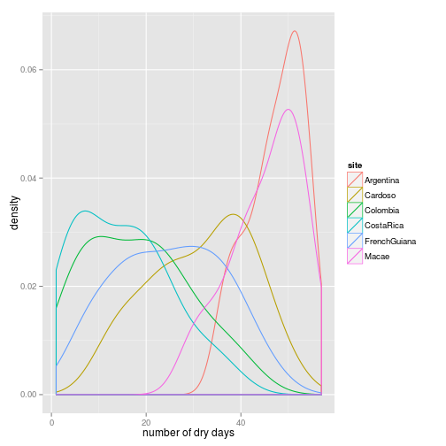

## comparison of the different sites 


```r
## code for calculating site characteristics first read in all data:

library(plyr)
library(reshape2)
library(ggplot2)
source("../Rscripts/all_sites_parameters.R")
```


```r
sites <- c("Cardoso", "Colombia", "CostaRica", "FrenchGuiana", "Macae", "Argentina")

all_schedules <- lapply(sites, scheduleread)
names(x = all_schedules) <- sites

## standardize names
all_schedules_renamed <- lapply(all_schedules, function(df) {
    names(df)[1:4] <- c("trt.name", "mu", "k", "temporal.block")
    df
})

allsites <- ldply(.data = all_schedules_renamed, .fun = melt, id.vars = c("trt.name", 
    "mu", "k", "temporal.block"))
names(allsites)[names(allsites) == ".id"] <- "site"
```


```r
# ggplot(allsites,aes(x=site,y=mu))+geom_point()
# ggplot(allsites,aes(x=site,y=k))+geom_point()
ggplot(subset(allsites, subset = allsites$trt.name == "mu1k1"), aes(x = mu, 
    y = k, colour = site)) + geom_point(size = 3)
```

 

```r

trtcols <- dcast(data = allsites, formula = site + temporal.block + variable ~ 
    trt.name, value.var = "value")

```


```r
head(allsites)
```

```
##      site  trt.name   mu   k temporal.block variable value
## 1 Cardoso mu0.1k0.5 0.76 0.1              c    day.1    NA
## 2 Cardoso mu0.2k0.5 1.51 0.1              b    day.1    NA
## 3 Cardoso mu0.4k0.5 3.02 0.1              b    day.1    NA
## 4 Cardoso mu0.6k0.5 4.53 0.1              b    day.1    NA
## 5 Cardoso mu0.8k0.5 6.05 0.1              b    day.1    NA
## 6 Cardoso   mu1k0.5 7.56 0.1              b    day.1    NA
```

```r
unique(allsites$variable)
```

```
##   [1] day.1  day.2  day.3  day.4  day.5  day.6  day.7  day.8  day.9  day.10
##  [11] day.11 day.12 day.13 day.14 day.15 day.16 day.17 day.18 day.19 day.20
##  [21] day.21 day.22 day.23 day.24 day.25 day.26 day.27 day.28 day.29 day.30
##  [31] day.31 day.32 day.33 day.34 day.35 day.36 day.37 day.38 day.39 day.40
##  [41] day.41 day.42 day.43 day.44 day.45 day.46 day.47 day.48 day.49 day.50
##  [51] day.51 day.52 day.53 day.54 day.55 day.56 day.57 day.58 day.59 day.60
##  [61] day.61 day.62 day.63 day.64 day.65 day.66 day.67 day.68 X1     X2    
##  [71] X3     X4     X5     X6     X7     X8     X9     X10    X11    X12   
##  [81] X13    X14    X15    X16    X17    X18    X19    X20    X21    X22   
##  [91] X23    X24    X25    X26    X27    X28    X29    X30    X31    X32   
## [101] X33    X34    X35    X36    X37    X38    X39    X40    X41    X42   
## [111] X43    X44    X45    X46    X47    X48    X49    X50    X51    X52   
## [121] X53    X54    X55    X56    X57    X58    X59    X60    X61    X62   
## [131] X63    X64    X65    X66    X67   
## 135 Levels: day.1 day.2 day.3 day.4 day.5 day.6 day.7 day.8 ... X67
```

```r
allsites$Day <- as.numeric(gsub(allsites$variable, pattern = "[a-zA-Z]+\\.?", 
    replacement = ""))
ggplot(allsites, aes(x = Day, y = value, group = trt.name)) + geom_path() + 
    facet_wrap(~site)
```

```
## Warning: Removed 210 rows containing missing values (geom_path).
## Warning: Removed 150 rows containing missing values (geom_path).
## Warning: Removed 150 rows containing missing values (geom_path).
## Warning: Removed 60 rows containing missing values (geom_path).
## Warning: Removed 60 rows containing missing values (geom_path).
## Warning: Removed 150 rows containing missing values (geom_path).
```

 

```r

## remove the temporal block days: tmpblock_sites <-
## split(allsites,allsites$temporal.block) no_extra_days <-
## rbind(tmpblock_sites$a[!tmpblock_sites$a$Day%in%c(1:2,63:68),],
## tmpblock_sites$b[!tmpblock_sites$b$Day%in%c(1:3,64:68),],
## tmpblock_sites$c[!tmpblock_sites$c$Day%in%c(1:4,65:68),])
## no_extra_days[which(is.na(no_extra_days$value)),]
## ggplot(allsites,aes(x=Day,y=value,group=trt.name))+geom_path()+facet_grid(~mu)

allsites_noNA <- allsites[!is.na(allsites$value), ]

# ddply(allsites_noNA,.variables=.(sites),summarize,m)
```


```r

summary_sites <- ddply(allsites_noNA, .variables = .(site, trt.name), .fun = summarize, 
    maxrain = max(value), drydays = sum(value == 0))
```


```r
ggplot(summary_sites, aes(x = drydays, colour = site)) + geom_density() + xlab("number of dry days")
```

 

