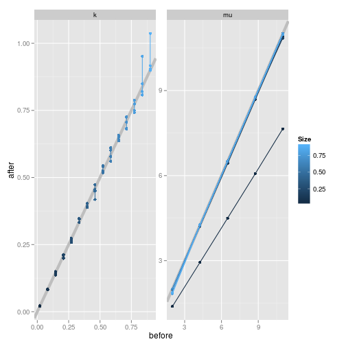
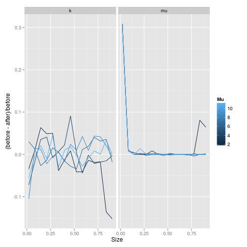
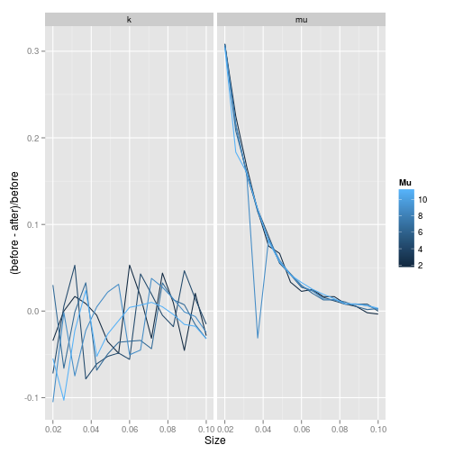
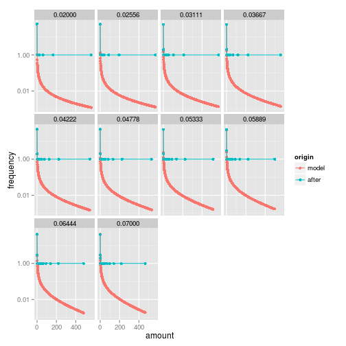

## When does our 'integerization' technique fail

Our experimental design is planned by an algorithim which 

1. fits the negative binomial distribution to observed rainfall data
2. modifies these parameters in accordance with our experimental design
3. attempts to squeeze these new distributions into a 60-day period
4. performs several other housekeeping tasks.

Our present problem is with step #3. For sites with extremely low values of k (the dispersion parameter, or **Size** of the distribution), the algorithim is producing too little water.

The code below illustrates the problem:


```r
library(ggplot2)
library(MASS)
library(reshape2)
library(plyr)
library(bbmle)
```

```
## Loading required package: stats4
```

```r
source("../Rscripts/precipitation.functions.R")
opts_chunk$set(warning = FALSE, message = FALSE, dev = "png")
```


A function which runs `integerized()` for a given pair of paramters and produces a data frame comparing the original numbers (before) to numbers calculated from the output of `integerized()`

```r

rain_simulate <- function(Size = 0.08, Mu = 20, n.data = 6, duration) {
    params.rainfall_df <- data.frame(param = c("k", "mu"), value = c(Size, Mu))
    ## use these average parameter estimates to calculate the 'new data', derived
    ## from the probability density function
    new.data <- integerized(mean.dist = Mu, k = Size)
    estimate_after_integerize <- nbin.estimate(new.data)
    after <- data.frame(when = "after", param = names(estimate_after_integerize), 
        value = estimate_after_integerize)
    before <- data.frame(when = "before", params.rainfall_df)
    master <- rbind(before, after)
    data.frame(Size, Mu, dcast(master, param ~ when))
}
```


The range of parameters found across ALL our sites is about k = 0.02 to 0.9, and mu = 2 to 11.  We can repeat the process above for all combinations of these.  Parameters "before" and "after" are compared to the 1:1 line (gray).

```r
approx_range_k <- seq(0.02, 0.9, length.out = 15)
approx_range_mu <- seq(2, 11, length.out = 5)
parameter_ranges <- expand.grid(k = approx_range_k, mu = approx_range_mu)
parameter_success <- list(NULL)

for (i in 1:nrow(parameter_ranges)) {
    parameter_success[[i]] <- rain_simulate(Size = parameter_ranges[i, ]$k, 
        Mu = parameter_ranges[i, ]$mu)
}

successful <- do.call(rbind, parameter_success)

ggplot(successful, aes(x = before, y = after, group = Size, colour = Size)) + 
    geom_abline(intercept = 0, slope = 1, colour = "grey", size = 2) + geom_point() + 
    geom_line() + facet_wrap(~param, scales = "free")
```

 

The parameters are well-behaved except for very high values of k (which tend to be hard to recover in only 60 days).  *mu* behaves very well indeed, except for very low values of k, when it is always underestimated.

We can examine this same data as percent difference from the parameter's "before" value.  How much error was added by the algorithm?

```r
ggplot(successful, aes(x = Size, y = (before - after)/before, group = Mu, colour = Mu)) + 
    geom_line() + facet_wrap(~param)  #+geom_vline(xintercept=approx_range_k[2])
```

 

Seems like k is always hard to estimate, while mu is just fine -- UNLESS you're below k=0.0829

lets zoom right in there:


```r
approx_range_k <- seq(0.02, 0.1, length.out = 15)
approx_range_mu <- seq(2, 11, length.out = 5)
parameter_ranges <- expand.grid(k = approx_range_k, mu = approx_range_mu)
parameter_success <- list(NULL)

for (i in 1:nrow(parameter_ranges)) {
    parameter_success[[i]] <- rain_simulate(Size = parameter_ranges[i, ]$k, 
        Mu = parameter_ranges[i, ]$mu)
}
successful2 <- do.call(rbind, parameter_success)
ggplot(successful2, aes(x = Size, y = (before - after)/before, group = Mu, colour = Mu)) + 
    geom_line() + facet_wrap(~param)
```

 

Now we can set a threshold: values of k lower than 0.04 will cause a more than 10% change in mu, independent of the values of mu.

What happened to the water?


```r
make.points <- function(one.year.data) {
    freqs <- as.numeric(table(one.year.data))
    rainfalls <- sort(unique(one.year.data))
    data.frame(amount = rainfalls, frequency = freqs)
    # one.yr.data <- data.frame(rainfalls=rainfalls,freqs=as.numeric(freqs))
    # one.yr.data <- one.yr.data[order(one.yr.data$rainfalls),]
    # with(one.yr.data,lines(rainfalls,freqs))
}


rain_comp <- function(Size = 0.08, Mu = 20, n.data = 6, duration) {
    # browser()
    params.rainfall_df <- data.frame(param = c("k", "mu"), value = c(Size, Mu))
    ## use these average parameter estimates to calculate the 'new data', derived
    ## from the probability density function
    new.data <- integerized(mean.dist = Mu, k = Size)
    
    rainfall.probs <- sapply(0:max(new.data), dnbinom, mu = Mu, size = Size)
    
    rainfall.pred.model <- rbind(data.frame(origin = "model", amount = 0:max(new.data), 
        frequency = rainfall.probs * 60), data.frame(origin = "after", make.points(new.data)))
    
    data.frame(k = Size, rainfall.pred.model)
    
}

comparison <- do.call(rbind, lapply(seq(0.02, 0.07, length.out = 10), rain_comp))
ggplot(comparison, aes(x = amount, y = frequency, colour = origin, )) + geom_point() + 
    geom_line() + facet_wrap(~k) + scale_y_log10()
```

 

Seems to be the increasing tail.

So, what can we do?  The exponential shape of the curve caused by changes in k suggests that multiplying by some rate might work.


