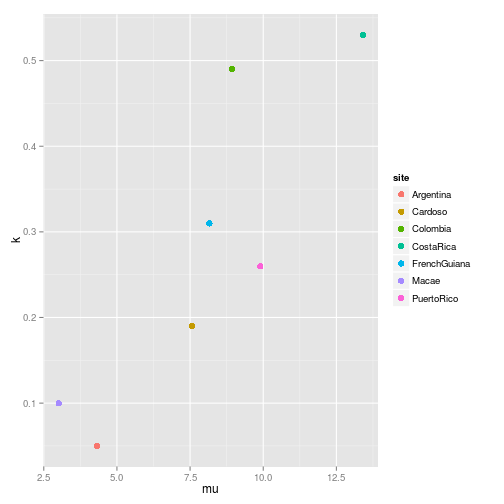
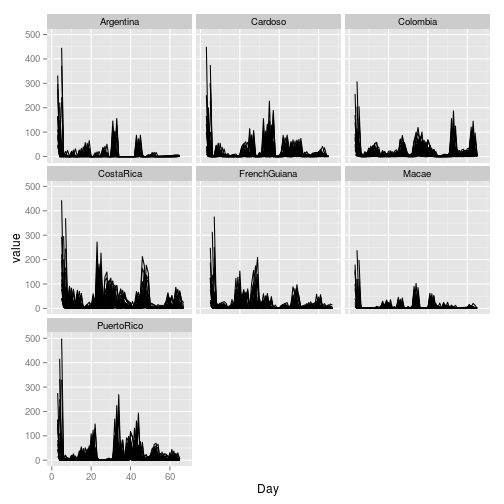
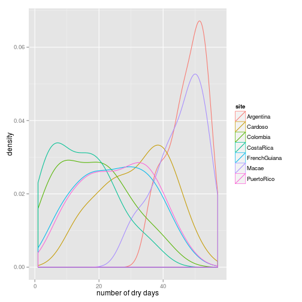

# comparison of the different sites 

By graphing the control (mu1k1) treatments, we can compare the amount (_mu_) and the variation in rainfall (_k_) across all sites:
 

We can get another look at the same data by graphing the amount of rain over time for all treatments at all sites.  Each figure is a fieldsite; each has 30 lines showing the water amounts added to every bromeliad over time.
 

The number of dry days in a treatment depends on both mu and k.  Some analyses have suggested that the number of dry days is useful for predicting community responses to the treatments.  So, how does each fieldsite differ in the number of dry days per treatment?  Each density plot has n=30 (one for every bromeliad in each treatment)

 

